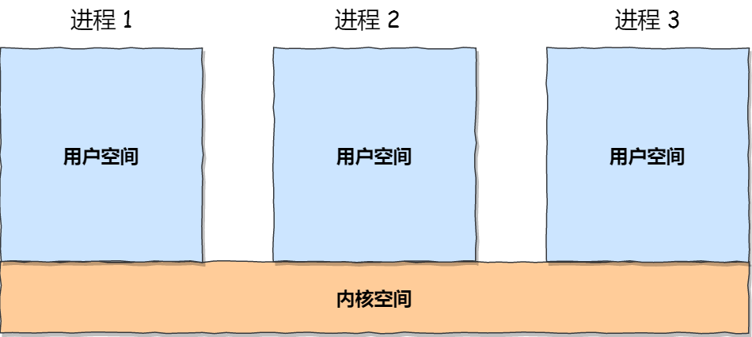

**Android进程间通信**

https://mp.weixin.qq.com/s/mblyh6XrLj1bCwL0Evs-Vg

每个进程的用户地址空间都是独立的，一般而言是不能互相访问的，但内核空间是每个进程都共享的，所以进程之间要通信必须通过内核。



**1.管道:**像水管一样，单向流动，且是阻塞的；

一端写入，在数据被读取之前，这个进程就会卡住

从管道的一段写入的数据，实际上是缓存在内核中的，另一端读取，也就是从内核中读取这段数据。另外，管道传输的数据是无格式的流且大小受限。

```c
//创建管道文件
mkfifo myPipe
//系统功能调用
int pipe(int fd[2])

```

**2.信号量**：**信号量其实是一个整型的计数器，主要用于实现进程间的互斥与同步，而不是用于缓存进程间通信的数据**。

信号量表示资源的数量，控制信号量的方式有两种原子操作：

- 一个是 **P 操作**，这个操作会把信号量减去 -1，相减后如果信号量 < 0，则表明资源已被占用，进程需阻塞等待；相减后如果信号量 >= 0，则表明还有资源可使用，进程可正常继续执行。
- 另一个是 **V 操作**，这个操作会把信号量加上 1，相加后如果信号量 <= 0，则表明当前有阻塞中的进程，于是会将该进程唤醒运行；相加后如果信号量 > 0，则表明当前没有阻塞中的进程；

P 操作是用在进入共享资源之前，V 操作是用在离开共享资源之后，这两个操作是必须成对出现的。

```c
//创建信号量，返回信号id
int semget(key_t key,int nsems,int flags)
//删除或初始化信号量
int semctl(int semid, int semnum, int cmd, ...);
union semun
{ 
    int val;  //使用的值
    struct semid_ds *buf;  //IPC_STAT、IPC_SET 使用的缓存区
    unsigned short *arry;  //GETALL,、SETALL 使用的数组
    struct seminfo *__buf; // IPC_INFO(Linux特有) 使用的缓存区
};
//改变信号量的值
int semop(int semid, struct sembuf *sops, size_t nops);
struct sembuf{ 
    short sem_num;   //除非使用一组信号量，否则它为0 
    short sem_op;   //信号量在一次操作中需要改变的数据，通常是两个数，                                        
                    //一个是-1，即P（等待）操作， 
                    //一个是+1，即V（发送信号）操作。 
    short sem_flg; //通常为SEM_UNDO,使操作系统跟踪信号量， 
                  //并在进程没有释放该信号量而终止时，操作系统释放信号量 
}; 

```

**3.信号：**信号是进程间通信机制中**唯一的异步通信机制**，因为可以在任何时候发送信号给某一进程，一旦有信号产生，我们就有下面这几种，用户进程对信号的处理方式。

	**1.执行默认操作**。Linux 对每种信号都规定了默认操作，例如，上面列表中的 SIGTERM 信号，就是终止进程		的意思。Core 的意思是 Core Dump，也即终止进程后，通过 Core Dump 将当前进程的运行状态保存在文件里面，方便程序员事后进行分析问题在哪里。
	
	**2.捕捉信号：**我们可以为信号定义一个信号处理函数。当信号发生时，我们就执行相应的信号处理函数。
	
	**3.忽略信号**。当我们不希望处理某些信号的时候，就可以忽略该信号，不做任何处理。有两个信号是应用进程无法捕捉和忽略的，即 `SIGKILL` 和 `SEGSTOP`，它们用于在任何时候中断或结束某一进程。

**4.共享内存：****就是两个进程都拿出一块虚拟地址空间来，映射到相同的物理内存中**。这样这个进程写入的东西，另外一个进程马上就能看到了，都不需要拷贝来拷贝去，传来传去，大大提高了进程间通信的速度。但是涉及到多个进程通信，就会存在同步问题

**5.socket**

**6.消息队列：**消息队列本质上是位于内核空间的链表，链表的每个节点都是一条消息。每一条消息都有自己的消息类型，消息类型用整数来表示，而且必须大于 0。

两个进程使用同一个消息队列，一个取一个发达到通信的目的

```c
// 创建和获取 ipc 内核对象
int msgget(key_t key, int flags);
// 将消息发送到消息队列
int msgsnd(int msqid, const void *msgp, size_t msgsz, int msgflg);
// 从消息队列获取消息
ssize_t msgrcv(int msqid, void *msgp, size_t msgsz, long msgtyp, int msgflg);
// 查看、设置、删除 ipc 内核对象（用法和 shmctl 一样）
int msgctl(int msqid, int cmd, struct msqid_ds *buf);
```

**消息队列不适合比较大数据的传输**，因为在内核中每个消息体都有一个最大长度的限制，同时所有队列所包含的全部消息体的总长度也是有上限。在 Linux 内核中，会有两个宏定义 `MSGMAX` 和 `MSGMNB`，它们以字节为单位，分别定义了一条消息的最大长度和一个队列的最大长度。

**消息队列通信过程中，存在用户态与内核态之间的数据拷贝开销**，因为进程写入数据到内核中的消息队列时，会发生从用户态拷贝数据到内核态的过程，同理另一进程读取内核中的消息数据时，会发生从内核态拷贝数据到用户态的过程。

## Binder

1.binder驱动 ：相当于把程序注入到了内核中，上层可通过操作文件的方式来进行内核操作

源码目录：[driver/staing/android/binder.c](http://androidxref.com/kernel_3.18/xref/drivers/staging/android/binder.c#binder_update_page_range)

**binder_init**：创建/dev/binder节点(之后就可通过open(/dev/binder打开了))

**binder_open**：为每个进程分配一个binder_proc结构体，保存当前进程的相关信息，并将其赋值给file.private_data,这样后续的操作都能直接拿到

**binder_mmap**：通过get_vm_area获得vm_struct空间，binder_update_page_range分配物理页面，并将vm_struct和vm_area_struct都映射到物理页面上

**binder_ioctls：binder通信的核心方法，根据传入的cmd进行不同的操作

2.binder通信协议:RPC


